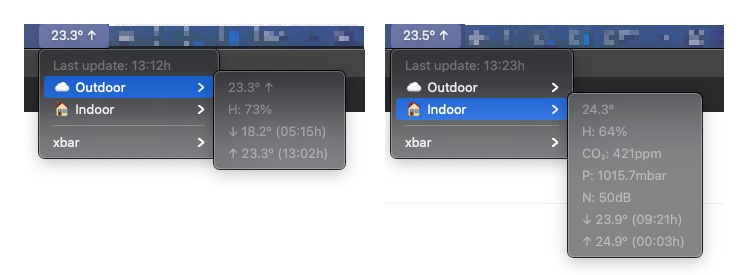

# my-netatmo

Display measures from my Netatmo devices.



This project uses [xbar](https://github.com/matryer/xbar) to add a status-bar application on macOS
and [netatmo](https://github.com/rene-d/netatmo) module to show the weather information coming from [Netatmo stations](https://www.netatmo.com/es-es/weather/weatherstation).

## Installation

Create a Python3 virtualenv and install inside the requirements:

```console
$ pip install -r requirements.txt
```

Fix paths on [run.5m.sh](run.5m.sh) and link the main script from the [default xbar plugin location](https://github.com/matryer/xbar#the-plugin-directory):

```console
$ ln -s run.5m.sh "/Library/Application Support/xbar/plugins"
```

## Usage

Create a `~/.netatmorc` file with the [following fields](https://github.com/rene-d/netatmo#credentials):

- client_id
- client_secret
- username
- password
- default_device_id

🎩 &nbsp; **Run xbar and see the magic!**
